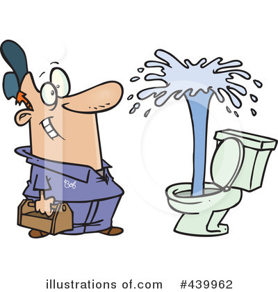

############################
# README
# Comp20 Midterm Project: Plumber Chat
# Spring 2020
# Group: Anti Reptilia
# Group Members: Eli Dow, Emil Polakiewicz, Gus Erikson, Matthew Trivigno, Ryan Dreher
# Purpose: A website for clients to get in contact with plumbers
############################

URL: https://gustaverikson95.github.io/Comp20Project/index.html

What does the business do and how does the website help them?
  One of the biggest struggles for plumbers is dealing with their wide network of clients that span long distances. Today, a 
  plumber would get a call to request for help, and can only determine the issue when they arrive at the client’s house. This 
  website seeks to ease the potential long distance a plumber must travel, and allows communication between plumber and client 
  in order to determine if a visit is necessary. Website is a platform to connect clients and plumbers so that plumbers can 
  figure out the problem without driving over, which maximizes efficiency. The website has an account system, so clients would 
  log in with a username.
  
Section of Code we are most proud of:

 <form class="modal-content animate" method="post">
    

      
&times;

      
    

    

      <label for="uname"><b>Username</b></label>
      <input type="text" placeholder="Enter Username" name="uname" required>

      <label for="psw"><b>Password</b></label>
      <input type="password" placeholder="Enter Password" name="psw" required>
        
      <button type="submit">Login</button>
    

    

      <button type="button" onclick="document.getElementById('id01').style.display='none'" class="cancelbtn">Cancel</button>
    

  </form>

<button onclick="document.getElementById('pos').style.display='block'" style="width:auto;">Sign Up</button>

	<a href="clientSignUp.html" class="refbutton">Customer Sign Up</a>
	<a href="plumberSignUp.html" class="refbutton">Plumber Sign Up</a>
	</style>

  
  <form class="modal-content animate" method="post">
    

      
&times;

      
    

Why we picked this: It is something that we have not covered in class, so we thought it was cool that we could make such a
complex pop-up as opposed to the regular alert().

How it works:

Requirements:

At least 7 pages:
  - Home Page
  - Client Sign Up Page
  - Plumber Sign Up Page
  - About Page
  - Appointments Page
  - Prices Page
  - Messaging Page
  - Plumber Page
  - Login Pages (kind of)

External and Internal Style Sheet:
  - Every page has an internal style sheet, and uses the external style sheet
  
Fixed Page Elements:
  - Fixed Nav bar 

Javascript and JQuery:
 - Javascript on Appointments Page for form validation
 - Javascript on Client Sign Up Page for form validation
 - Javascript on Plumber Sign Up Page for form validation
 - JQuery on Home Page for Fade and Slide animations
 - JQuery on Appointments Page, Plumber Sign up, and Client sign up for Fade animations

Form:
  - On Appointments Page, Client Sign Up Page, Plumber Sign Up Page, Login Pages

Multiple Columns:
 - On Price Page, Appointments Page, Plumber Page 

Responsive/Mobile Friendly: Yes

Works online: Yes

No broken links: Yes

No lorum ipsum: Yes

Who did what:

Eli - Price Page, External Stylesheet
Gus - About Page, External Stylesheet
Emil - Appointments Page, Home Page, Client and Plumber Sign Up Pages
Ryan - Messaging, Log in Pages
Matt - Plumber Page
